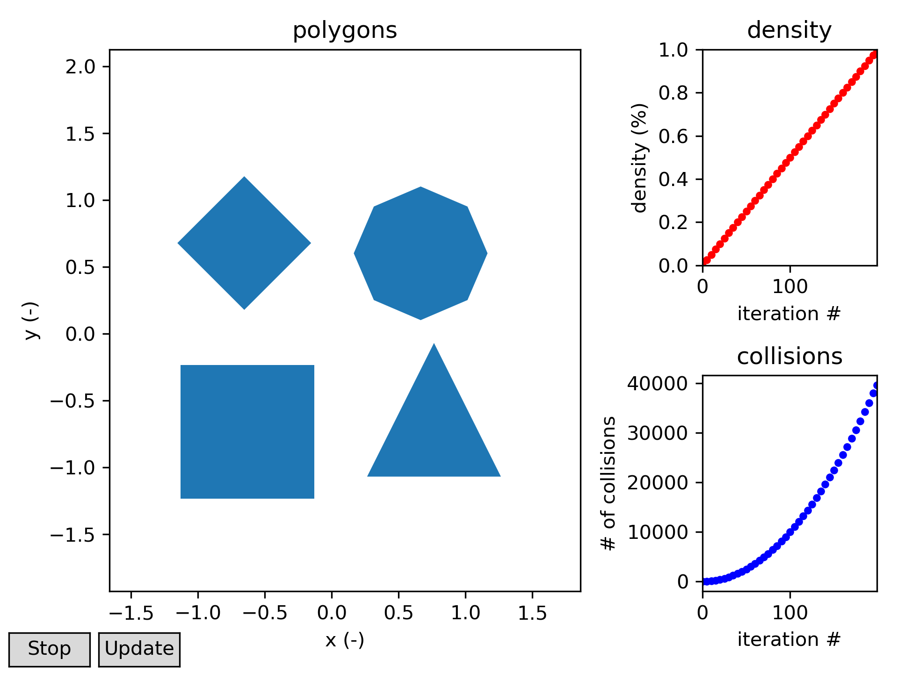

# Cell Packing

Numerical simulations of diffusion in biological tissue require realistic simulation substrates.
Both brain and cardiac/skeletal tissue consists of densly packed cells.
Since segmentation is often infeasible, synethic (algorithmically generated) substrates are used.
[Mingasson et al 2017](https://doi.org/10.3389/fninf.2017.00005) proposed a simulator for white matter microstructure, which packs circular shapes that represent axons by attracting them towards the centre until convergence.
The aim of this project is to extend the functionality of [AxonPacking](https://github.com/neuropoly/axonpacking) by allowing for different shapes to be packed.
The objects are represented by polygons, and additionally a target region of arbitrary shape may be specified.

## User interface

Besides the core `PolyPacker` class, which takes care of packing, we provide a `GUI` class.
This handles updates to the polygons and shows convergence parameters.
There exists also a `CLI` class for printing to the command prompt in case of headless simulations.

The packing simulation looks like this:

## Installation

It is recommended to use a virtual environment for Python, such as Anaconda (e.g. `conda create -n packing python`).
First, install the external packages via `pip install -r requirements.txt`.
Then, install the code in this repository using `pip install -e .`.
The `-e` flag only adds the package path to Python and leaves the source files editable.
